  

  
  
  
  

---

### 🛠️ Core Engineering Focus

<table>
  <tr>
    <td width="50%" valign="top">
      <h4>🚀 Cloud & DevOps Architecture</h4>
      
Designing automated CI/CD pipelines, containerized deployment workflows, and highly resilient AWS infrastructure.

      
<code>Docker</code> • <code>Kubernetes</code> • <code>AWS</code> • <code>Linux</code> • <code>Terraform</code> • <code>CI/CD</code>

    </td>
    <td width="50%" valign="top">
      <h4>💻 Full-Stack Web Development</h4>
      
Crafting high-performance client interfaces and secure, scalable server architectures with modern web technologies.

      
<code>Next.js</code> • <code>React</code> • <code>TypeScript</code> • <code>Node.js</code> • <code>Tailwind CSS</code> • <code>PostgreSQL</code>

    </td>
  </tr>
  <tr>
    <td width="50%" valign="top">
      <h4>🏆 Competitive Programming & Algorithms</h4>
      
Deep expertise in Data Structures, dynamic programming, graph theory, and low-level performance optimization.

      
<code>C++ (STL)</code> • <code>Python</code> • <code>Algorithmic Optimization</code> • <code>Problem Solving</code>

    </td>
    <td width="50%" valign="top">
      <h4>🌐 Distributed Systems & Design</h4>
      
Connecting sleek frontend design systems with fault-tolerant, high-throughput backend APIs and database indexing.

      
<code>REST & GraphQL</code> • <code>Microservices</code> • <code>Serverless</code> • <code>System Design</code>

    </td>
  </tr>
</table>

 

### 💻 Technical Ecosystem

#### Languages & Core

  

#### Frontend Architecture

  

#### Backend & Databases

  

#### Cloud, DevOps & Tooling

  

---

### 📊 GitHub Metrics & Trophies

  
  

  
  

---

### 🎮 Contribution Graph & Activity

  

  <picture>
    <source media="(prefers-color-scheme: dark)" srcset="https://raw.githubusercontent.com/xyushman/xyushman/output/github-contribution-grid-snake-dark.svg" />
    <source media="(prefers-color-scheme: light)" srcset="https://raw.githubusercontent.com/xyushman/xyushman/output/github-contribution-grid-snake.svg" />
    
  </picture>

